# 产品使用文档

## LLM-ECO-VIZ：开源AI大模型生态分析与可视化 

## 前言

​	请读者注意，本文档的主要目的是向**使用者**全方位地展现`LLM-ECO-VIZ`的产品的**操作说明**、**页面展示**，以及**如何用本产品进行生态分析**。若想了解我们的数据来源、项目架构等**技术内容**，请移步[产品技术文档](产品技术文档.md)。

​	我们的[复赛ppt](复赛.pptx)融合了我们所有文档的内容并包含动图演示，可供读者参考。

​	为洞察大模型领域的开原生态情况，本项目基于GitHub和Hugging Face两个开源社区的活动数据，对两个社区的大模型领域开源项目进行了生态分析与可视化。从使用者的视角来看，产品由如下几部分组成：

- GitHub平台
  - GitHub平台大模型相关repo的数据大屏
- Hugging Face平台
  - Hugging Face大模型影响力排行榜
  - Hugging Face大模型生态网络图
  - Hugging Face大模型全局生态数据大屏

## 快速体验

​	访问https://jettycoffee.cn体验我们的产品。

## 目录	

- [一、主页](#一主页)
- [二、GitHub部分](#二github部分)
- [三、Hugging Face部分](#三hugging-face部分)
  - [1. LLM Leaderboard（大模型排行榜）](#1-llm-leaderboard大模型排行榜)
    - [(1) 什么是LLM Leaderboard？](#（1）什么是llm-leaderboard)
    - [(2) 页面与各按键功能展示](#（2）页面与各按键功能展示)
  - [2. 大模型生态网络](#2-大模型生态网络)
    - [(1) 什么是大模型生态网络？](#（1）什么是大模型生态网络)
    - [(2) 单个模型的生态网络图（以Llama-3.1-70B为例）](#（2）单个模型的生态网络图以llama-31-70b为例)
    - [(3) 多个模型的生态网络图（以Meta-Llama公司为例）](#（3）多个模型的生态网络图以meta-llama公司为例)
  - [3. 大模型全局生态大屏](#3-大模型全局生态大屏)

## 一、主页

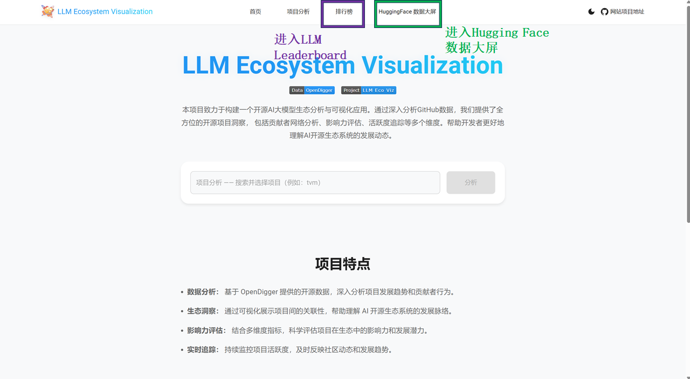

​	主页提供了入口进入GitHub项目分析（放置在主页）、Hugging Face 模型排行榜（点击链接跳转）以及 Hugging Face 数据大屏（点击链接跳转）。

## 二、GitHub部分

​	本部分利用了 OpenDigger 上的`labeled_data`以及其数据，对 GitHub 上与AI和大模型领域相关的repo做了单repo的数据大屏。 

​	例如，我们在项目分析框中输入Langchain-Chatchat进行分析。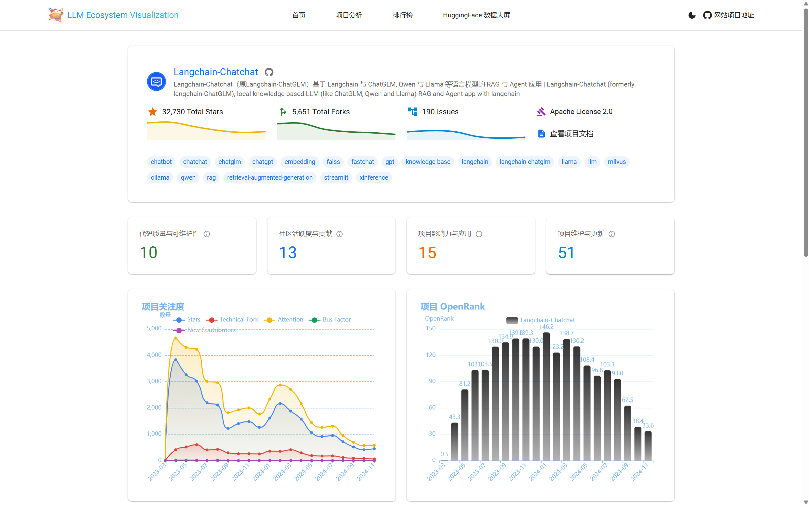

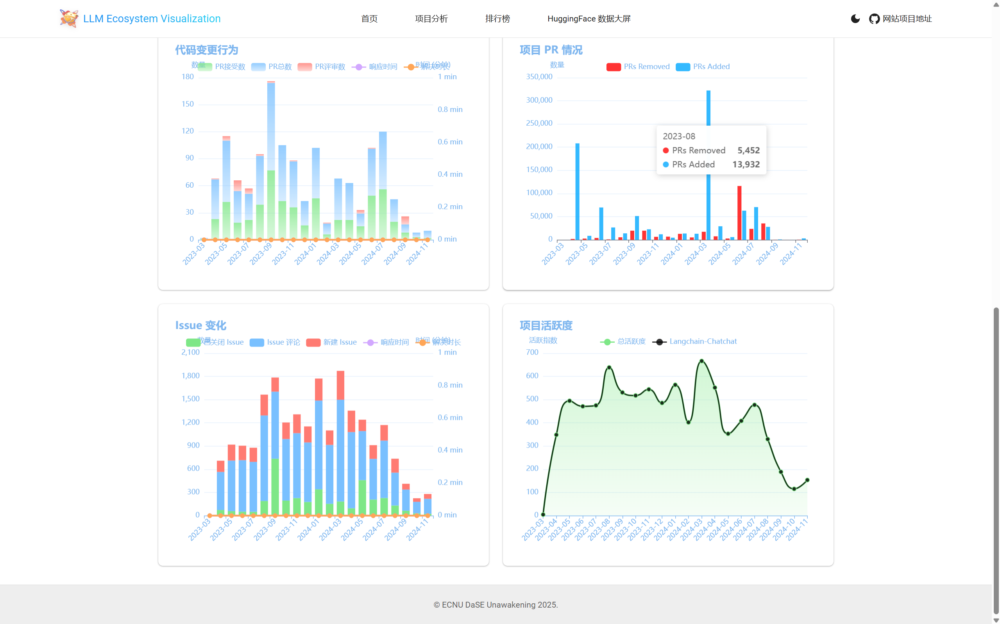

​	界面上部展示了项目简介与指标，其中的链接均会指向相应的网页，方便用户访问；中间是四个维度的项目质量评分，用户鼠标点击相应的看板可以得到其具体的评分标准和得分情况；下侧是项目的一些活动情况的时序图，包括关注度、OpenRank值等。

​	此外，图表有高度的互动性。可以见下面的动图：

## 三、Hugging Face部分

### 1. LLM Leaderboard（大模型排行榜）

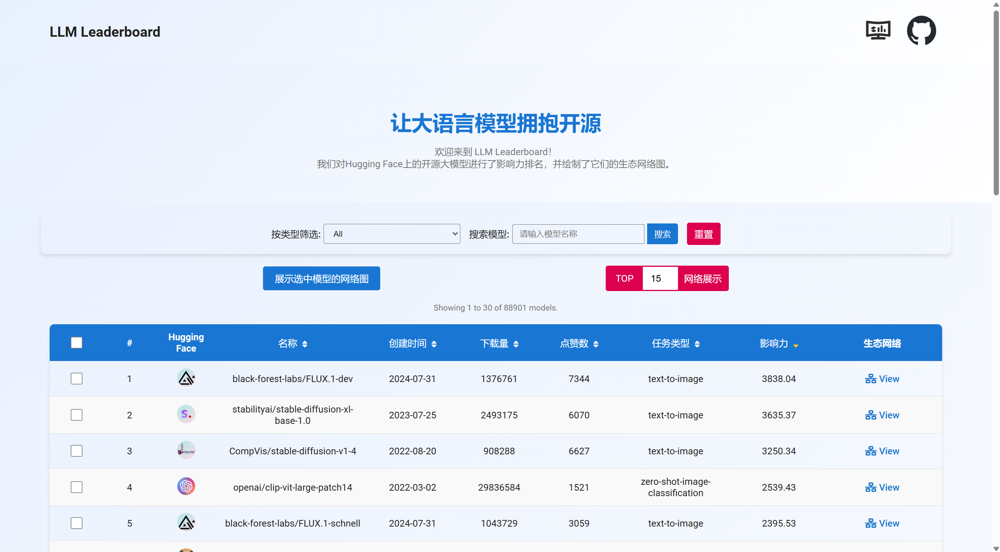

#### （1）什么是LLM Leaderboard？

​	LLM Leaderboard 是专为 Hugging Face 社区打造的一款模型排名与浏览平台。受 PageRank 算法启发，结合大模型的领域特点与专家经验，平台构建了一套影响力算法（详见技术文档），它以模型的点赞量、下载量以及其父、子模型的影响力和下游应用的关注度等指标为输入，输出一个影响力值，据此对 Hugging Face 上的大模型进行综合排名，帮助用户快速识别最具潜力和价值的模型。

​	然而，LLM Leaderboard 的功能不止于排名，它还是一个高效的模型信息浏览工具，可以按任务类型、影响力、下载量、点赞量以及创建时间等维度对模型进行筛选、排序和搜索。点击模型图标可直达 Hugging Face 平台网址，用户可以轻松找到满足需求的模型。 

​	表格的最后一栏指向各个模型的生态网络图链接。我们为每个模型生成了对应的生态网络图，清晰展示模型的衍生和关联关系。用户还可以选择多个模型，同时查看它们的生态关系网络。同时，平台支持快速选择影响力值 TOP K 的模型，生成其生态关系网，助力用户高效分析模型生态。关于生态网络功能的设计与用途，请参阅【二、2】部分。

#### （2）页面与各按键功能展示

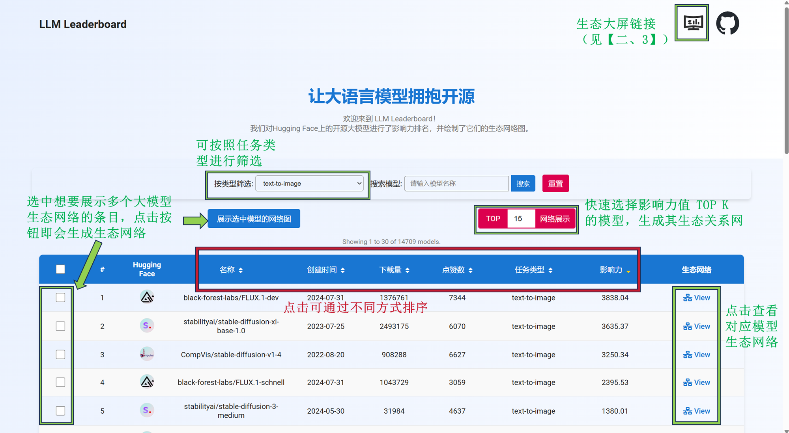	

​	上图细致地说明了页面中各个元素的功能。

### 2. 大模型生态网络

#### （1）什么是大模型生态网络？

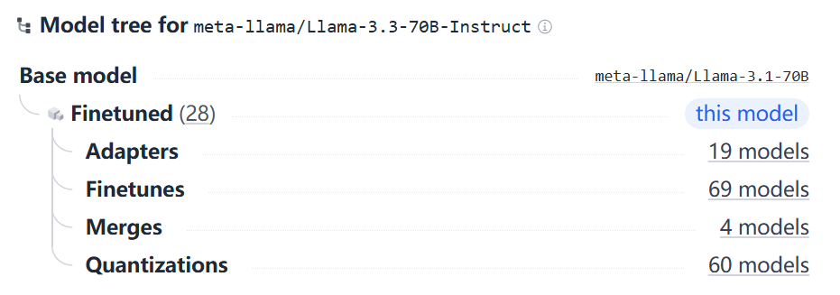

​	Hugging Face的模型都处在一个`Model Tree`当中。在这个设定下，一个模型可能是其他模型的`衍生模型`（包括`适配(Adapters)`，`微调(Finetunes)`，`融合(Merge)`和`量化(Quantization)`），也可能是其他模型的`基模型(base model)`。在上图中，`Llama-3.3-70B-Instruct`就是`Llama-3.1-70B`的`finetune`版本，也就是说`Llama-3.1-70B`是`Llama-3.3-70B-Instruct`的`base model`；而`Llama-3.3-70B-Instruct`本身又有着许多的衍生模型。

​	基于`Model Tree`，我们就可以构建出一个关系网络——以一个`base model`为根结点出发，它的衍生模型就是它的孩子结点，而它的衍生模型也可能会有更多的衍生模型……直至没有衍生模型的模型成为网络的叶子节点。而结点我们以模型作者的头像来表示，其大小与影响力值成正相关。

#### （2）单个模型的生态网络图（以Llama-3.1-70B为例）

​	下面我将模拟使用者，执行查看Llama-3.1-70B的生态网络并对其进行数据洞察的全过程，并在过程中介绍网页设计。

1. 首先，我们在排行榜界面搜索Llama-3.1-70B，点击view进入生态网络界面: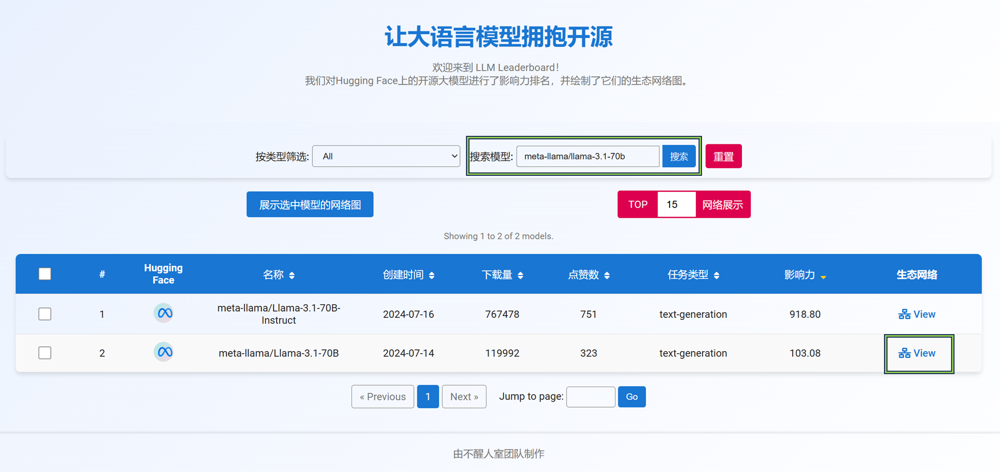

2. 进入后，看到如下界面：

   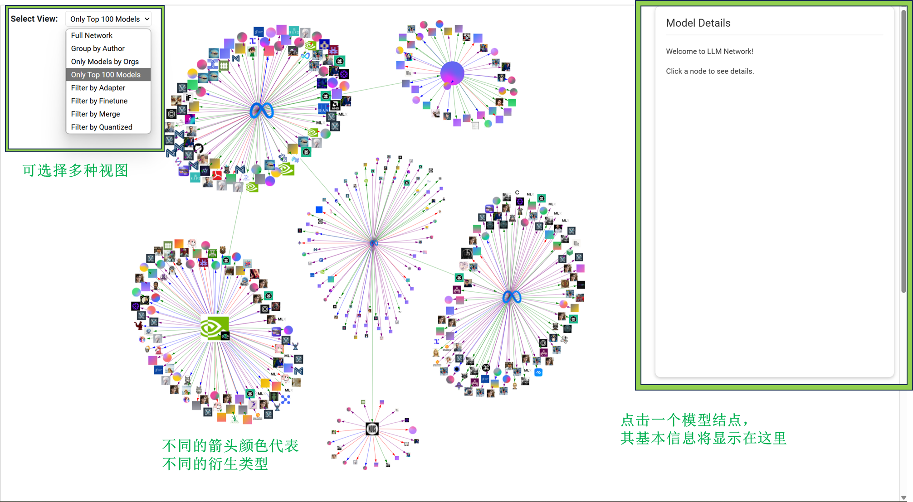

   - 点击一个模型结点，其基本信息将会在右面的`Model Details`中。
   - 左上角的菜单可选择多种不同的视图：
     - 默认情况下，该页面选择`Only Top 100 Models`选项，即仅展示每个模型影响力前100的衍生模型。
     - 完整的视图（`Full Network`）会展示所有衍生模型，对于结点数过大的图将会导致渲染过慢、难以识别的问题。
     - `Group by Author`会将所有相同发布者发布的模型折叠为一个结点，其相应的结点基本信息也会不同于普通的结点，在3中会进行展示。
     - `Only Models by Orgs`会只展示Hugging Face平台认证组织发布的模型。
     - `Filter by ***`会仅展示特定类型的衍生模型。

   - 边的颜色代表不同的衍生类型。 

   - 这幅图可放大缩小、平移，图中的结点也可以拖动，有着良好的互动体验。

3. 我们点击几个结点，即可展示其对应的模型信息，如下面动图所示: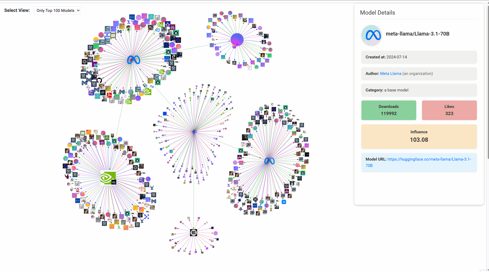
   - 右侧信息栏会展示模型的基本元数据以及相应的链接地址。
   - `Downloads`, `Likes`和`Influence`栏的颜色会依据其值的大小来变换颜色的深浅。
   通过刚刚我们与图的互动，我们可以洞察到如下信息：
   - Llama-3.1-70B有许多的衍生模型，其中有三个影响力较高的模型，都是它的微调版本，分别为自家公司的Llama-3.1-70B-Instruct 和 Llama-3.3-70B-Instruct，以及 NousResearch 的 Hermes-3-Llama-3.1-70B。
   - 其中，Llama-3.1-70B-Instruct 影响力最大，而且它也有两个影响力极高的微调版本：NVIDIA 公司的 Llama-3.1-Nemotron-70B-Instruct-HF 以及 独立用户 Matt Shumer 发布的 Reflection-Llama-3.1-70B。

4. 接下来，我们试一试`Group by Author`视图：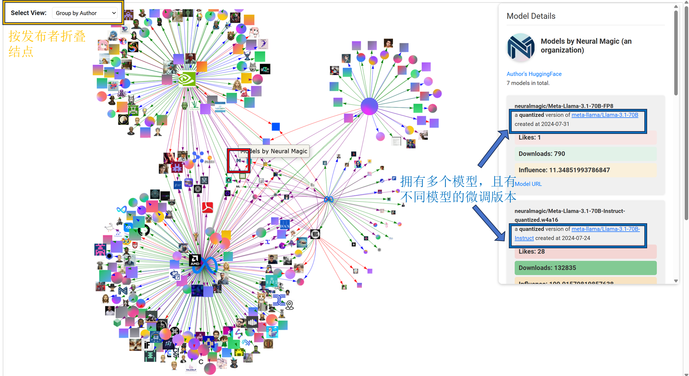
   - 除了根节点以外，所有的结点只要是相同作者，都会被折叠在一起。我们可以看到最明显的是两个微调版本的Llama模型被折叠在了一起。
   - 此外，还有许多作者拥有多个模型的微调版本，因此会被多个模型所指向。如图所示，我们点击红色方框所框住的这个模型，它来自Neural Magic，它共有7个有关模型。其中，如图所示，信息栏里前两个模型分别是Llama-3.1-70B的量化版本和Llama-3.1-70B-Instruct的量化版本。根据图中的信息，我们可以看到它还拥有另外两个作者的衍生模型。

5. 接下来，我们展示一下`Full Network`, `Filter by Quantized`和`Filter by Finetune`：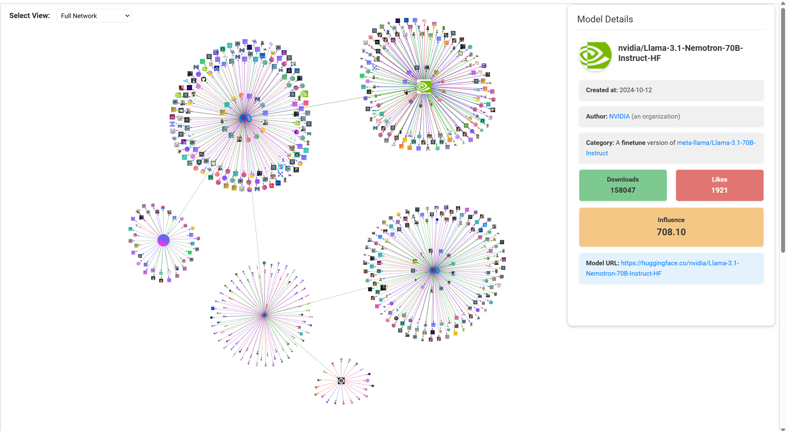

   可见，`Full Network`展现的结点比较多，适合全局洞察一个模型的衍生模型情况。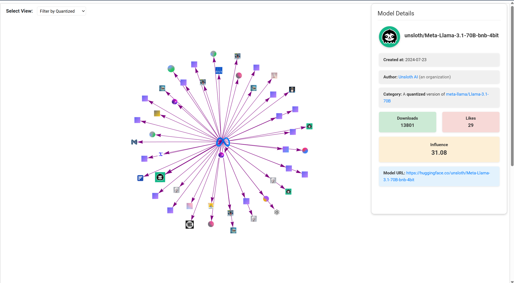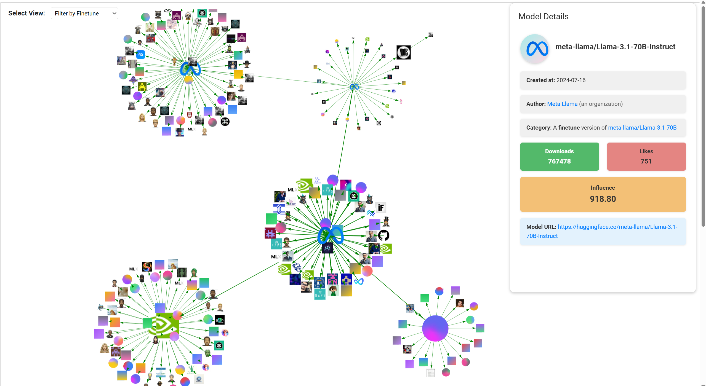

   `Filter by ***`版本可以单独拎出某一种类型的衍生模型，方便用户查找。

#### （3）多个模型的生态网络图（以Meta-Llama的模型为例）

​	在 LLM Leaderboard，我们搜索关键词 meta-llama，筛选 text-generation 类型的模型，全选第一页的模型，点击绘制出 Meta-Llama 在文本生成领域影响力前30的所有模型的生态网络图：

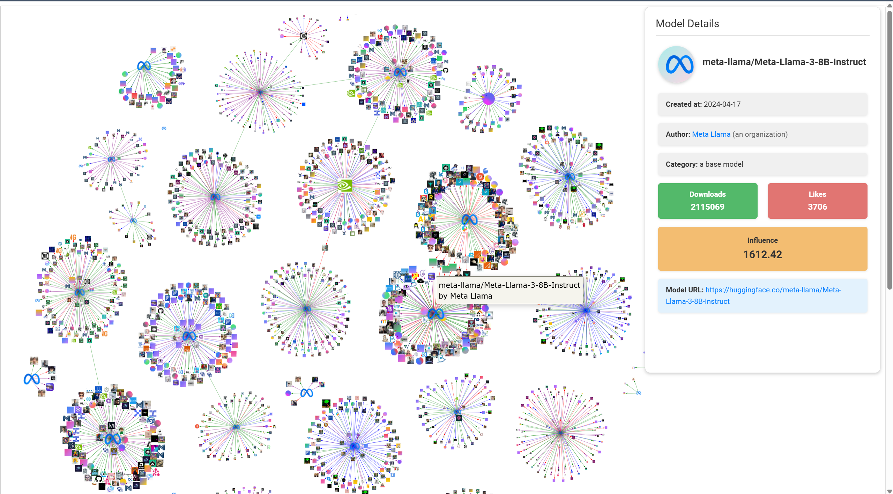	

​	由于多模型的生态网络图涉及到大量的衍生模型结点，因此我们只展示每个模型影响力前100的衍生模型。由此我们可以洞察出 Meta-Llama 公司在文本生成领域影响力前30的所有模型的相互关系以及影响力的直观比较。

​	此外，我们也可以在 LLM Leaderboard 直接在红色按钮中输入数字，生成影响力 TOP K 的模型全局生态网络图。

​	需要说明的是，我们当前的数据仅包括点赞量前1000的模型以及其一阶衍生模型，并且有些创作者在发布模型时并没有依照`Model Tree`的规则，因此当前部分模型的关系网络可能并不全面。而即便如此，我们也可以从中洞察出模型间的生态关系与各自的影响力。并且，我们的应用具有高度可扩展性，只需要提供一个更加完备的数据集，我们的可视化就会更加全面。随着大模型技术的持续飞速发展，以及 Hugging Face 开源平台的生态不断壮大，大模型的开发成本和门槛将逐步降低，吸引越来越多的开发者投入这一领域。因此，我们的应用在未来必将具备更高的实用价值，成为理解和探索大模型生态的重要工具。

### 3. 大模型全局生态大屏

​	在首页点击“Hugging Face生态大屏”或者在 LLM Leaderboard 界面的右上角点击大屏图标即可进入大模型生态大屏页面。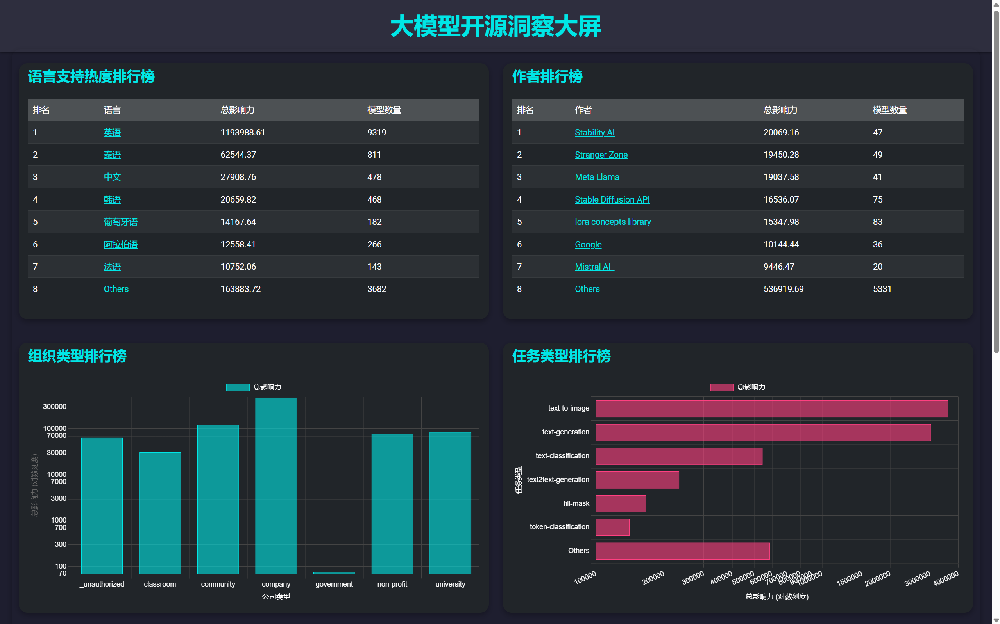

​	我们的大屏视角独特。基于大屏，我们可以洞察出许多有趣的事实。前四栏内容及我们所得到的洞察分别为：

- 大模型对各种语言的支持情况TOP榜
  - **英语占据绝对主导地位**：英语的总影响力远远超过其他语言，支持的模型数量也高达9319个。这表明，大语言模型的开发仍然以英语为核心，其他语言的支持尚处于相对初步阶段。
  - **非拉丁语言模型发展极具潜力**：除英语之外，排名靠前的语言包括泰语、中文和韩语。这表明，非英语语言的大模型生态尚有巨大的发展空间，尤其是在中文和其他非拉丁语言的支持上。
- 当前最具影响力的作者TOP榜
  - **Stability AI**：影响力最大。它推出了广受欢迎的 **Stable Diffusion** 系列，这些模型主要用于图像生成任务，是近年来生成式 AI 的热点应用之一，深受大众喜爱，应用市场广阔。
  - **Meta Llama**：作为全球领先的科技公司，Meta 拥有丰富的计算资源和算法研究能力，这使得 Llama 模型在 NLP 领域表现出色。并且，Llama 的部分版本近来不断宣布开源，大大扩展了其生态影响力。
- 所有组织类型排行榜
  - **公司主导大模型开发**：公司类型组织的总影响力遥遥领先，表明企业在推动大模型开发上扮演了主要角色。这可能是因为企业资金能力雄厚，拥有强大的算力，且高精尖人才集中，并且有盈利模式的驱动。
  - **社区型组织的力量不容忽视**：社区及大学、非营利组织的总影响力也非常高，仅次于公司。这显示了开源社区的巨大潜力和贡献，为大模型的发展提供了丰富的资源和创新能力。
  - **政府的影响较小**：相比之下，政府的影响力较低，这或许说明大模型技术的开发很少是由政府挂名进行。
- 大模型任务类型热度排行榜
  - **Text-to-Image 和 Text-Generation 是最主要的任务**：Text-to-Image 和 Text-Generation 任务的影响力遥遥领先，反映了生成式模型在视觉和文本生成领域的广泛应用和需求，是最贴近大众的两大类型。

​	值得一提的是，大屏的每一个条目都是可互动的。点击后会弹出你所点击的语言/作者/组织类型/任务类型中的大模型影响力最高的前10名的信息。如我们点击“阿拉伯语”，可以得到支持阿拉伯语的大模型中影响力最高的前10名：

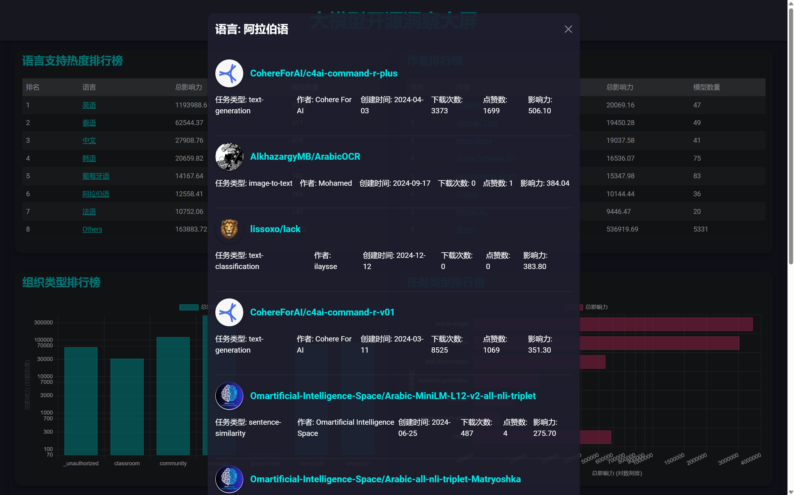

​	大屏的最下面是一个 TOP 大模型树图，展示当前热门大模型的份额占比。在未来展望部分，我们计划做一个更加精美的树图，可以按多种方式排序、同时展示多种不同类型的大模型的热度占比。

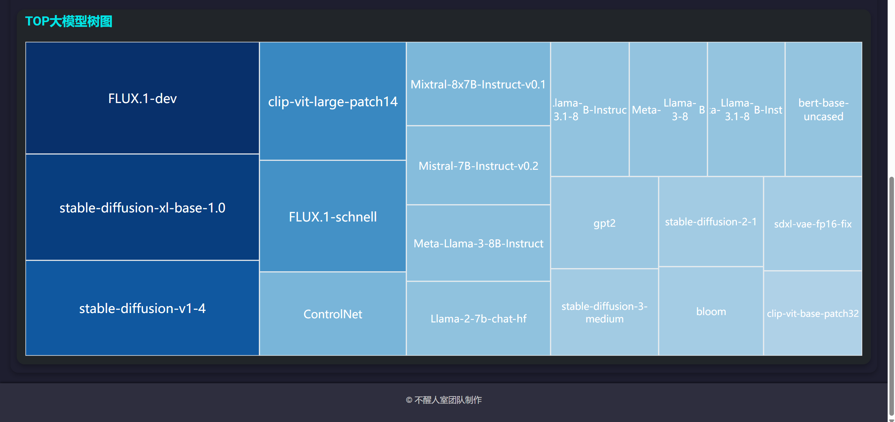
